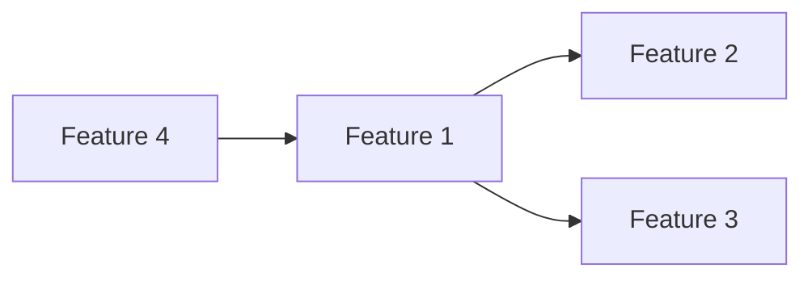

# Planning Output Templates

Use the appropriate template when generating planning output. Replace `{placeholders}` with actual values.

## Pre-Flight Validation Report

```markdown
## Project Planning — Pre-Flight Validation

### Data Sources
| Source | Path | Status | Details |
|--------|------|--------|---------|
| Functional Requirements | `/docs/requirements/functional/` | ✅/❌ | {N} FRs found |
| Non-Functional Requirements | `/docs/requirements/non-functional/` | ✅/❌ | {N} NFRs found |
| Business Rules | `/docs/requirements/business-rules.md` | ✅/❌ | {N} rules found |
| Personas | `/docs/requirements/personas.md` | ✅/❌ | {N} personas found |
| Gap Analysis | `/docs/requirements/gap-analysis.md` | ✅/❌ | {N} gaps, {N} critical |
| Clarifications | `/docs/requirements/clarifications.md` | ✅/❌ | {N} total, {N} open |
| Project Config | `/docs/projectassetlocation` | ✅/❌ | {details} |
| Existing Plan | `/docs/plan/project-plan.md` | ✅/❌ | {exists or not} |

### Requirements Readiness
| Metric | Value | Threshold | Status |
|--------|-------|-----------|--------|
| Total FRs | {N} | >0 | ✅/❌ |
| Approved FRs (%) | {%} | >70% | ✅/⚠️/❌ |
| Open P0/P1 CLRs | {N} | 0 | ✅/⚠️/❌ |
| Critical Gaps | {N} | 0 | ✅/⚠️/❌ |

### Blockers
- {critical issues preventing planning}

**Overall: ✅ Ready | ⚠️ Partial (can plan but gaps exist) | ❌ Blocked**
```

## Planning Input Options

### Option A: Timeline-First (derive team size)
```markdown
Ask the user for:
- Project start date
- Project end date (hard deadline or flexible)
- Working days per sprint (default: 10 = 2-week sprints)
- Buffer/contingency (default: 15% of total)
- Constraints (holidays, team availability windows, external dependencies)

Agent calculates:
- Available sprints = (end - start) / sprint length
- Required velocity = total SP / available sprints
- Required team size = required velocity / avg individual velocity ({8-12 SP/dev/sprint})
- Team composition (frontend:backend:QA ratio based on tech stack)
```

### Option B: Resource-First (derive timeline)
```markdown
Ask the user for:
- Team composition (e.g., 2 FE, 2 BE, 1 QA, 1 DevOps)
- Individual velocity (default: 10 SP/dev/sprint)
- Sprint length (default: 2 weeks)
- Buffer/contingency (default: 15%)

Agent calculates:
- Team velocity = sum of individual velocities * efficiency factor (0.7–0.8)
- Required sprints = total SP / team velocity
- Projected end date = start + (sprints * sprint length)
- Add buffer for contingency
```

### Option C: Both Provided (validate feasibility)
```markdown
Agent validates:
- Is the timeline achievable with the given team?
- Velocity gap = required velocity - team velocity
- If gap > 20%: flag as aggressive, offer alternatives
- If gap < -20%: suggest reducing timeline or team
```

## Project Plan Structure

```markdown
# Project Plan — {Project Name}

**Created:** {date}
**Last Updated:** {date}
**Timeline:** {start} → {end} ({N} sprints, {N} weeks)
**Team Size:** {N} ({composition})
**Total Scope:** {N} story points across {N} features
**Methodology:** Agile/Scrum with {N}-week sprints

---

## 1. Project Overview
{1-2 paragraph summary}

## 2. Timeline & Milestones
| Milestone | Target Date | Sprint | Entry Criteria | Exit Criteria | Status |
|-----------|------------|--------|----------------|---------------|--------|
| Project Kickoff | {date} | S0 | {criteria} | {criteria} | ✅/⏳ |
| Alpha | {date} | S{N} | {criteria} | {criteria} | ✅/⏳ |
| Beta | {date} | S{N} | {criteria} | {criteria} | ✅/⏳ |
| RC | {date} | S{N} | {criteria} | {criteria} | ✅/⏳ |
| GA | {date} | S{N} | {criteria} | {criteria} | ✅/⏳ |

## 3. Feature Breakdown
| Feature | FRs | SP | Priority | Sprint(s) | Dependencies | Status |
|---------|-----|-----|----------|-----------|-------------|--------|

## 4. Sprint Plan
### Sprint {N}: {Goal} ({start} → {end})
**Velocity Target:** {N} SP
**Focus:** {primary feature/theme}

| Task ID | Task | Feature | SP | Assignee | Dependencies | Status |
|---------|------|---------|-----|----------|-------------|--------|

## 5. Architecture & Technical Approach
{High-level architecture, component design, integration patterns}

## 6. Risk Register
| ID | Risk | Probability | Impact | Score | Mitigation | Owner | Status |
|----|------|-------------|--------|-------|------------|-------|--------|

## 7. Resource Allocation
| Role | Count | Sprint Velocity | Allocation |
|------|-------|----------------|------------|

## 8. Dependencies
### Internal Dependencies (Feature-to-Feature)
| Source | Target | Type | Risk |
|--------|--------|------|------|

### External Dependencies
| Dependency | Owner | Due Date | Status | Impact if Delayed |
|-----------|-------|----------|--------|------------------|

## 9. SDLC Phase Plan
| Phase | Sprint Range | Activities | Exit Criteria |
|-------|-------------|------------|---------------|
| Design | S0–S{N} | Architecture, DB design, API contracts | Design docs approved |
| Development | S{N}–S{N} | Feature implementation | Code complete, unit tests pass |
| Testing | S{N}–S{N} | Integration, E2E, UAT | All test suites pass |
| Staging | S{N}–S{N} | Performance, security, staging deploy | Staging sign-off |
| Deployment | S{N} | Production deployment, monitoring | GA live |
| Hypercare | S{N}–S{N} | Bug fixes, monitoring, optimization | Stability confirmed |
```

## Plan Health Scorecard

```markdown
## Plan Health Scorecard

**Date:** {date}

| Dimension | Weight | Score | Weighted | Details |
|-----------|--------|-------|----------|---------|
| Requirement Coverage | 20% | {0-100} | {N} | {N}/{M} FRs covered by tasks |
| Sprint Balance | 15% | {0-100} | {N} | Max velocity deviation: ±{N}% |
| Dependency Completeness | 15% | {0-100} | {N} | {N}/{M} tasks have deps mapped |
| Test Coverage | 10% | {0-100} | {N} | {N}/{M} features have test tasks |
| Milestone Clarity | 10% | {0-100} | {N} | {N}/{M} milestones have entry/exit criteria |
| Risk Mitigation | 15% | {0-100} | {N} | {N}/{M} high risks have mitigations |
| Clarification Readiness | 15% | {0-100} | {N} | {N}/{M} blocking CLRs resolved |
| **Overall Health** | **100%** | — | **{N}%** | {Healthy 80+ / Needs Attention 60-79 / At Risk <60} |

### Top Issues
| # | Issue | Severity | Recommendation |
|---|-------|----------|----------------|
| 1 | {issue} | {sev} | {fix} |
```

## What-If Scenario Comparison

```markdown
## What-If Scenario Analysis

**Date:** {date}

### Scenario Comparison
| Dimension | Current Plan | Option A: {name} | Option B: {name} |
|-----------|-------------|------------------|------------------|
| Timeline | {N} sprints ({date}) | {N} sprints ({date}) | {N} sprints ({date}) |
| Team Size | {N} | {N} | {N} |
| Scope (SP) | {N} | {N} | {N} |
| Monthly Cost | ${N} | ${N} | ${N} |
| Risk Level | {level} | {level} | {level} |
| Key Trade-off | — | {trade-off} | {trade-off} |

### Recommendation
**Preferred:** {option} — {rationale}
```

## Impact Analysis

```markdown
## Scope Change Impact Analysis

**Change:** {description}
**Type:** Add Feature | Remove Feature | Modify Scope | Change Timeline | Change Resources

### Impact Summary
| Metric | Before | After | Delta |
|--------|--------|-------|-------|
| Total SP | {N} | {N} | {±N} |
| Sprints Required | {N} | {N} | {±N} |
| Team Required | {N} | {N} | {±N} |
| End Date | {date} | {date} | {±N weeks} |

### Affected Sprints
| Sprint | Current Load | New Load | Over/Under | Action |
|--------|-------------|----------|-----------|--------|

### Cascade Effects
{Dependencies affected, milestones shifted, risks introduced}

### Options
1. Absorb: {how}
2. Extend timeline by {N} sprints
3. Add {N} resources
4. Reduce scope: drop {feature}

### Recommendation
{recommendation with rationale}
```

## Release Plan

```markdown
## Release Plan — {Project Name}

### Release Train
| Release | Sprint | Date | Features | SP | Type |
|---------|--------|------|----------|-----|------|
| MVP (v1.0) | S{N} | {date} | {features} | {N} | Major |
| v1.1 | S{N} | {date} | {features} | {N} | Minor |
| v2.0 | S{N} | {date} | {features} | {N} | Major |

### MVP Feature Set
| Feature | Priority | SP | Rationale |
|---------|----------|-----|-----------|

### Release Criteria
| Release | Entry Criteria | Exit Criteria |
|---------|----------------|---------------|
```

## Resource Check Report

```markdown
## Resource Allocation Report

**Date:** {date}

### Team Utilization
| Role | Name | Capacity (SP) | Allocated (SP) | Utilization % | Status |
|------|------|--------------|----------------|--------------|--------|

### Over-Allocated
| Name | Sprint | Allocated | Capacity | Excess | Action |
|------|--------|-----------|----------|--------|--------|

### Rebalancing Recommendations
1. {recommendation}
```

## Burndown Forecast

```markdown
## Burndown & Velocity Forecast

**Date:** {date}

### Velocity Trend
| Sprint | Planned SP | Completed SP | Velocity | Trend |
|--------|-----------|-------------|----------|-------|

### Burndown
| Sprint | Remaining SP | Projected Remaining | On Track? |
|--------|-------------|-------------------|-----------|

### Forecast
- Current velocity: {N} SP/sprint
- Remaining work: {N} SP
- Sprints needed: {N}
- Projected completion: {date}
- Original target: {date}
- Status: ✅ On Track | ⚠️ {N} sprints behind | ❌ Significant delay
```

## Dependency Heatmap

```markdown
## Dependency Heatmap

### Feature Dependencies


### Risk Concentration
| Feature | Internal Deps | External Deps | Total | Risk |
|---------|--------------|--------------|-------|------|
| {feature} | {N} | {N} | {N} | 🔴/🟡/🟢 |

### External Dependencies
| Dependency | Owner | Due Date | Status | Features Blocked |
|-----------|-------|----------|--------|-----------------|
```

## Executive Summary

```markdown
# Project Plan Executive Summary — {Project Name}

**Date:** {date}
**Status:** ✅ On Track | ⚠️ At Risk | ❌ Blocked

## 1. Overview
{1-2 sentence project summary}

## 2. Key Numbers
| Metric | Value |
|--------|-------|
| Timeline | {start} → {end} ({N} weeks) |
| Team Size | {N} ({composition}) |
| Total Scope | {N} story points, {N} features |
| Sprints | {N} ({N}-week sprints) |
| Monthly Cost | ${N} |

## 3. Plan Health
| Area | Status | Summary |
|------|--------|---------|
| Scope Coverage | {✅/⚠️/❌} | {summary} |
| Timeline Feasibility | {✅/⚠️/❌} | {summary} |
| Resource Adequacy | {✅/⚠️/❌} | {summary} |
| Risk Posture | {✅/⚠️/❌} | {summary} |
| Dependency Risk | {✅/⚠️/❌} | {summary} |

## 4. Key Risks
| # | Risk | Impact | Mitigation |
|---|------|--------|------------|

## 5. Milestones
| Milestone | Date | Status |
|-----------|------|--------|

## 6. Next Steps
1. {action}
```

## Pipeline Summary

```markdown
## Planning Pipeline Complete ✅

| Step | Status | Output |
|------|--------|--------|
| Validate | ✅ | {summary} |
| Create Plan | ✅ | {N} features, {N} tasks, {N} sprints |
| Review Plan | ✅ | Health: {N}% |
| Executive Summary | ✅ | Generated |

### Next Steps
1. Run `@5-product-owner create-stories` to create work items
2. Run `@3-requirement-analyst clr-init` to resolve any open blockers
```

## Help Reference

```markdown
## Project Planning — Command Reference

| Command | Description |
|---------|-------------|
| `help` | Show this command reference |
| `validate` | Pre-flight checks — verify data sources and requirements readiness |
| `status` | Show current plan summary, progress, blockers, health score |
| `create-plan` | Create plan from requirements + timeline OR resources (or both) |
| `update-plan` | Revise plan when requirements change, CLRs resolve, or constraints shift |
| `reschedule {timeline}` | Replan for a different timeline without changing scope |
| `estimate {feature}` | Estimate effort for a specific feature or scope change |
| `review-plan` | Audit plan for completeness, balance, and risks |
| `what-if {scenario}` | Compare alternative timelines, team sizes, or scope options |
| `impact {change}` | Analyze cost of adding/removing feature (SP, sprints, resources) |
| `release-plan` | Plan phased releases (MVP → v1.1 → v2.0) |
| `resource-check` | Detect over-allocated team members, propose rebalancing |
| `dependency-map` | Dependency heatmap across features and external blockers |
| `burndown` | Velocity trends and completion date forecast |
| `executive-summary` | 1-page non-technical brief for leadership |
| `export-summary` | Export plan summary for Confluence or email |
| `run-all {input}` | Full pipeline: validate → create-plan → review-plan → executive-summary |

### Workflow
validate → create-plan → review-plan → release-plan → executive-summary → export-summary
Or: `run-all`
```
