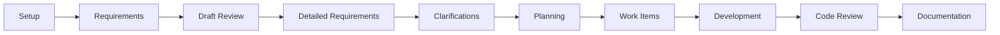

# Quick Reference - AI-Assisted SDLC Framework

## 🚀 Getting Started (5 Minutes)

### 1. Clone & Setup
```bash
git clone <this-repo> my-project
cd my-project
cp .env.example .env
```

### 2. Get Your Tokens
- **GitHub:** https://github.com/settings/tokens
- **Azure DevOps:** https://dev.azure.com/{org}/_usersSettings/tokens
- **Confluence:** https://id.atlassian.com/manage-profile/security/api-tokens

📖 **Detailed Guide:** [CREDENTIAL_SETUP.md](./.github/CREDENTIAL_SETUP.md)

### 3. Configure & Validate
```bash
# Edit .env with your tokens
@connectivity-agent setup
@connectivity-agent validate
```

---

## 📋 Agent Commands

| What You Want         | Command                                          |
|-----------------------|--------------------------------------------------|
| Setup integrations    | `@connectivity-agent setup`                      |
| Validate connections  | `@connectivity-agent validate`                   |
| Discover Requirements | `@requirement-discovery start discovery`         |
| Draft Requirements    | `@requirement-architect architect requirements`  |
| Analyze requirements  | `@3-requirement-analyst analyze {confluence-url}`   |
| Analyze designs       | `@screen-design-agent analyze {url-or-path}`     |
| Track clarifications  | `@3-requirement-analyst clr-init`                   |
| Resolve clarification | `@3-requirement-analyst clr-resolve CLR-{ID}`       |
| Create dev plan       | `@4-project-planning create-plan`                    |
| Create work items     | `@5-product-owner create-stories`             |
| Review PR             | `@code-review-agent review #{pr-number}`         |
| Generate docs         | `@docs-agent create-setup-guide`                 |

---

## 🔄 Typical Workflow



1. **Setup** (15-30 min) → `@connectivity-agent setup`
2. **Discovery** (2-4 hours) → `@requirement-discovery start discovery`
3. **First-Cut Draft** (2-4 hours) → `@requirement-architect architect requirements`
4. **Draft Review** (varies) → Review the first-cut draft in Confluence with stakeholders
5. **Detailed Requirements** (1-3 days) → `@3-requirement-analyst analyze {confluence-url}`
6. **Clarifications** (3-7 days) → `@3-requirement-analyst clr-init`
7. **Planning** (1-2 days) → `@4-project-planning create-plan`
8. **Work Items** (2-4 hours) → `@5-product-owner create-stories`
9. **Development** (varies) → GitHub Copilot generates code
10. **Code Review** (1-2 days/PR) → `@code-review-agent review`
11. **Documentation** (1-2 days) → `@docs-agent create-setup-guide`

### Requirements Flow at a Glance

1. `requirement-discovery` captures a **high-level discovery package**
2. `requirement-architect` turns it into a **first-cut draft requirement document**
3. The draft is reviewed and refined in **Confluence**
4. `3-requirement-analyst` is then used **downstream** to decompose approved content into detailed requirements

---

## 📁 Key Files

| File | Purpose |
|------|---------|
| `.env` | Your credentials (⚠️ NEVER commit!) |
| [.github/CREDENTIAL_SETUP.md](./.github/CREDENTIAL_SETUP.md) | How to get tokens |
| [.github/WORKFLOW_GUIDE.md](./.github/WORKFLOW_GUIDE.md) | Detailed workflow |
| [.github/PROMPT_TEMPLATES.md](./.github/PROMPT_TEMPLATES.md) | Example prompts |
| [.github/BASE_INSTRUCTIONS.md](./.github/BASE_INSTRUCTIONS.md) | Framework standards |

### Requirement Template Locations

| Path | Owner | Purpose |
|------|-------|---------|
| `requirements/requirement-discovery/templates/` | `requirement-discovery` | High-level discovery markdown template and JSON schema |
| `requirements/requirement-architect/templates/` | `requirement-architect` | First-cut draft requirement markdown template and JSON schema |

---

## 🔍 Common Tasks

### Start New Project
```bash
@connectivity-agent I'm starting project "{NAME}" with:
  GitHub: {repo-url}
  Azure DevOps: {org}/{project}
  Confluence: {space-url}
```

### Analyze Requirements from Confluence
```bash
@3-requirement-analyst analyze https://company.atlassian.net/wiki/spaces/PROJ/pages/123456

Focus on: authentication, payment, data privacy
```

> Use this after the BA team has reviewed the first-cut draft requirement document in Confluence.

### Create Full Development Plan
```bash
@4-project-planning create-plan with 3 developers, 2 week sprints
```

### Review Pull Request
```bash
@code-review-agent review #42

Focus areas: security, test coverage, Python PEP 8 compliance
```

---

## ⚠️ Troubleshooting

### "401 Unauthorized"
→ Token expired. Regenerate at token source, update `.env`

### "403 Forbidden"  
→ Token lacks permissions. Check [CREDENTIAL_SETUP.md](./.github/CREDENTIAL_SETUP.md) for required scopes

### "Agent not responding"
→ Ensure agent files in `.github/agents/{agent-name}/`

### "Connection failed"
→ Run `@connectivity-agent validate` to check all connections

---

## 📚 Documentation

- 🔐 [Credential Setup](./.github/CREDENTIAL_SETUP.md) - **Start here!**
- 📖 [Workflow Guide](./.github/WORKFLOW_GUIDE.md) - Complete process
- 💡 [Prompt Templates](./.github/PROMPT_TEMPLATES.md) - Copy-paste examples
- 🏗️ [Base Instructions](./.github/BASE_INSTRUCTIONS.md) - Standards
- 🤖 [Agent Docs](./.github/agents/) - Agent capabilities

---

## ✅ Pre-Flight Checklist

Before starting development:

- [ ] Cloned framework to new project
- [ ] Created `.env` from `.env.example`
- [ ] Generated all required tokens
- [ ] Added tokens to `.env`
- [ ] Verified `.env` in `.gitignore`
- [ ] Ran `@connectivity-agent validate`
- [ ] All connections show ✅

---

## 🎯 Success Metrics

| Metric | Target |
|--------|--------|
| Requirements clarity | >90% complete |
| Clarifications resolved | 100% Critical, 90% High |
| Test coverage | ≥80% |
| Code review quality | ≥80/100 (Grade B) |
| Time saved vs manual | >50% |

---

## 🆘 Getting Help

1. Check this Quick Reference
2. Review [WORKFLOW_GUIDE.md](./.github/WORKFLOW_GUIDE.md)
3. Try [PROMPT_TEMPLATES.md](./.github/PROMPT_TEMPLATES.md)
4. Check agent-specific docs in `.github/agents/`
5. Open issue in framework repository

---

**Framework Version:** 1.0.0  
**Last Updated:** March 25, 2026
